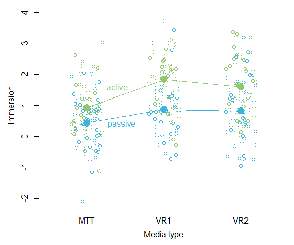
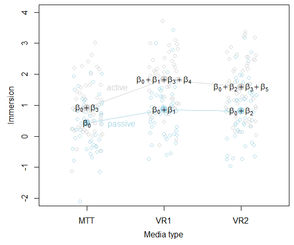

This post is meant to give you a better understanding how to interpret
parameters for categorical predictors in a mixed-effects model.
Understanding what the parameters mean is helpful when simulating data,
e.g., for power simulations.

# Example

This is an example where three different media are compared to each
other: A Multi-Touch Table (MTT) and two different Virtual Reality
conditions (VR1 and VR2). These are all presented to every subject
(within-factor `mediatype`). Additionally, we have a between-factor
`interaction` with levels `passive` and `active`. Subjects can either
actively interact for all media types or they can just passively look at
things presented to them with the three different media types. The
dependent varible is immersion. Subjects should feel more immersed when
actively interacting and Virtual Reality should also lead to more
immersion than a Multi-Touch Table.

``` r
library(lme4)

# Data simulation for a 2 (between) x 3 (within) design
set.seed(1046)
n <- 100
dat <- data.frame(id = factor(rep(1:n, each = 3)),
                  mediatype = factor(c("MTT", "VR1", "VR2")),
                  interaction = factor(rep(c("active", "passive"), each = 3),
                                       levels = c("passive", "active"))
                  )

## Set parameters
beta  <- c(.5, .2, .3, .4, .7, .4)
sigma <- .8
spi   <- .5
theta <- spi / sigma

## Simulate data
dat$y <- simulate(~ 1 + mediatype + interaction + mediatype:interaction +
                  (1 | id),
                  newparam = list(beta = beta, theta = theta, sigma = sigma),
                  newdata = dat)$sim_1

## Visualize simulated data
datm <- aggregate(y ~ mediatype + interaction, data = dat, FUN = mean)

colors <- c("#3CB4DC", "#91C86E")

par(mai = c(.8, .8, .1, .1), mgp = c(2.4, 1, 0))
plot(y ~ I(1:3), datm[datm$interaction == "passive", ],
     xlab = "Media type",
     ylab = "Immersion",
     xlim = c(0.5, 3.5),
     ylim = c(-2, 4),
     axes = FALSE,
     type = "n")
axis(1, at = 1:3, labels = c("MTT", "VR1", "VR2"))
axis(2)
box()
points(y ~ jitter(as.numeric(mediatype)), dat, col = colors[dat$interaction])
points(y ~ I(1:3), datm[datm$interaction == "passive", ], col = colors[1], type = "b", pch = 16, cex = 2)
points(y ~ I(1:3), datm[datm$interaction == "active", ], col = colors[2], type = "b", pch = 16, cex = 2)
text(1.45, 0.4, "passive", col = colors[1])
text(1.4, 1.6, "active", col = colors[2])
```



# Linear mixed-effects model

The following model will be fitted to the data. $$
   y = \beta_0 +
       \beta_1 mediatype_{VR1} +
       \beta_2 mediatype_{VR2} +
       \beta_3 interaction_{active} +
       \beta_4 (mediatype_{VR1} \times interaction_{active}) +
       \beta_5 (mediatype_{VR2} \times interaction_{active}) +
       \upsilon_0 +
       \varepsilon
$$ with
$\upsilon_0 \sim N(0, \sigma^2_{\upsilon_0}) ~~~~~\text{and}~~~~~  \varepsilon \sim N(0, \sigma^2_{\varepsilon})$

``` r
## Fit linear mixed-effects model

m1 <- lmer(y ~ 1 + mediatype + interaction + mediatype:interaction + (1| id),
           data = dat)

tab <- summary(m1)$coef
ci  <- confint(m1)
knitr::kable(round(cbind(tab, ci[3:8, ]), 3))
```

|                                | Estimate | Std. Error | t value |  2.5 % | 97.5 % |
|:-------------------------------|---------:|-----------:|--------:|-------:|-------:|
| (Intercept)                    |    0.421 |      0.128 |   3.295 |  0.172 |  0.670 |
| mediatypeVR1                   |    0.439 |      0.146 |   3.014 |  0.155 |  0.723 |
| mediatypeVR2                   |    0.393 |      0.146 |   2.702 |  0.110 |  0.677 |
| interactionactive              |    0.499 |      0.181 |   2.763 |  0.147 |  0.852 |
| mediatypeVR1:interactionactive |    0.474 |      0.206 |   2.304 |  0.073 |  0.876 |
| mediatypeVR2:interactionactive |    0.280 |      0.206 |   1.357 | -0.122 |  0.681 |

# Implied model formulae

The two categorical predictors are dummy coded. For `interaction` the
level `passive` is set as reference category. The dummy variable
$interaction_{active}$ is therefore 0 for `passive` and 1 for `active`.

``` r
contrasts(dat$interaction)
```

    ##         active
    ## passive      0
    ## active       1

The three level factor `mediatype` is represented by two dummy
variables, namely $mediatype_{VR1}$ and $mediatype_{VR2}$. Since `MTT`
is the reference category, the coding scheme is as folows.

``` r
contrasts(dat$mediatype)
```

    ##     VR1 VR2
    ## MTT   0   0
    ## VR1   1   0
    ## VR2   0   1

When we plug these dummy variables into the model formula from above, we
get a model formula for each data point of the aggregated data set.

$$\begin{align*}
   y_{11} & = \beta_0 +                               \upsilon_0 + \varepsilon & \text{mean for both reference categories (MTT and passive)}\\
   y_{12} & = \beta_0 + \beta_1 +                     \upsilon_0 + \varepsilon & \text{effect when going from MTT to VR1 for passive}\\
   y_{13} & = \beta_0 + \beta_2 +                     \upsilon_0 + \varepsilon & \text{effect when going from MTT to VR2 for passive}\\
   y_{21} & = \beta_0 + \beta_3 +                     \upsilon_0 + \varepsilon & \text{effect when goinf from passive to active for MTT}\\
   y_{22} & = \beta_0 + \beta_1 + \beta_3 + \beta_4 + \upsilon_0 + \varepsilon & \text{effect when going from MTT to VR1 for active}\\
   y_{23} & = \beta_0 + \beta_2 + \beta_3 + \beta_5 + \upsilon_0 + \varepsilon & \text{effect when going from MTT to VR2 for active}\\
\end{align*}$$

# Compare to plot



# Session info

``` r
sessionInfo()
```

    ## R version 4.4.1 (2024-06-14 ucrt)
    ## Platform: x86_64-w64-mingw32/x64
    ## Running under: Windows 10 x64 (build 19045)
    ## 
    ## Matrix products: default
    ## 
    ## 
    ## locale:
    ## [1] LC_COLLATE=German_Germany.utf8  LC_CTYPE=German_Germany.utf8   
    ## [3] LC_MONETARY=German_Germany.utf8 LC_NUMERIC=C                   
    ## [5] LC_TIME=German_Germany.utf8    
    ## 
    ## time zone: Europe/Berlin
    ## tzcode source: internal
    ## 
    ## attached base packages:
    ## [1] stats     graphics  grDevices utils     datasets  methods   base     
    ## 
    ## other attached packages:
    ## [1] lme4_1.1-35.5 Matrix_1.7-1 
    ## 
    ## loaded via a namespace (and not attached):
    ##  [1] nlme_3.1-166      cli_3.6.3         knitr_1.48        rlang_1.1.4      
    ##  [5] xfun_0.48         highr_0.11        jsonlite_1.8.9    minqa_1.2.8      
    ##  [9] htmltools_0.5.8.1 sass_0.4.9        rmarkdown_2.28    grid_4.4.1       
    ## [13] evaluate_1.0.1    jquerylib_0.1.4   MASS_7.3-61       fastmap_1.2.0    
    ## [17] lifecycle_1.0.4   yaml_2.3.10       compiler_4.4.1    Rcpp_1.0.13      
    ## [21] lattice_0.22-6    digest_0.6.37     nloptr_2.1.1      R6_2.5.1         
    ## [25] splines_4.4.1     bslib_0.8.0       tools_4.4.1       boot_1.3-31      
    ## [29] cachem_1.1.0
